# Architecture: Sistem Gudang Sneakers (SneakerVault)

## 1. Tech Stack

| Layer | Technology | Alasan |
|---|---|---|
| Monorepo | Turborepo 2.9 | Build caching, parallel tasks, dependency graph |
| Frontend | Next.js 16.2 (App Router + Proxy) + React 19.2 | SSR, Server Actions, sejalan dengan website client, mengikuti convention Next terbaru |
| UI Components | Tailwind CSS 4.3 + shadcn/ui | Cepat develop, accessible, customizable |
| Backend/API | Next.js Server Actions + API Routes | Collocated logic, type-safe |
| Database | Supabase (PostgreSQL 17) | Cloud, realtime, RLS, storage, auth built-in |
| Auth | Supabase Auth + `@supabase/ssr` 0.10 | Simple, role-based via custom claims, SSR cookie handling terbaru |
| File Storage | Supabase Storage | Foto produk, bukti pengiriman |
| Barcode (Camera) | react-zxing + @zxing/library 0.23 | React hook, support 1D+2D, actively maintained |
| Barcode (Hardware) | Native keyboard event listener | USB scanner = keyboard input, no library needed |
| Barcode Generate | JsBarcode 3.12 | Generate barcode image dari kode numerik |
| PDF Export | jsPDF 4 + jsPDF-AutoTable 5 | Client-side PDF generation |
| Excel Export | xlsx (SheetJS) | Client-side Excel generation |
| Validation | Zod 4.4 | Runtime type validation, shared between client/server |
| State Management | Zustand (minimal) | Lightweight, untuk scanner state |
| Deploy | Vercel / Node.js >=20.9 | Zero-config Next.js deploy, edge network |
| Language | TypeScript 6.0 (strict) | Type safety end-to-end |

---

## 2. Monorepo Structure

```
sneakervault/
├── apps/
│   └── web/                          # Main Next.js application
│       ├── app/
│       │   ├── (auth)/               # Public: login, register
│       │   │   ├── login/
│       │   │   └── register/
│       │   ├── (dashboard)/          # Protected routes (layout with sidebar)
│       │   │   ├── layout.tsx        # Dashboard shell: sidebar + topbar
│       │   │   ├── workspace/        # Role-based landing: tasks hari ini, quick actions
│       │   │   ├── overview/         # Owner dashboard (financials)
│       │   │   ├── inventory/        # Stok management (all roles)
│       │   │   ├── inbound/          # Barang masuk - scan (admin gudang)
│       │   │   ├── outbound/         # Barang keluar - packing (shopkeeper)
│       │   │   ├── orders/           # Order tracking & status (all roles)
│       │   │   ├── sold/             # Dedicated sold history view (owner, admin online)
│       │   │   ├── returns/          # Pengembalian (admin online + admin gudang)
│       │   │   ├── suppliers/        # Supplier management (admin gudang)
│       │   │   ├── reports/          # Laporan & export (owner)
│       │   │   └── settings/         # Users, activity log, delete requests (owner)
│       │   └── api/                  # API routes (webhooks, etc)
│       ├── components/               # App-specific components
│       │   ├── scanner/              # Barcode scanner UI
│       │   ├── inventory/            # Inventory table, filters
│       │   ├── orders/               # Order cards, status badges
│       │   └── dashboard/            # Charts, stats cards
│       ├── lib/                      # App utilities
│       │   ├── actions/              # Server actions (mutations)
│       │   └── queries/              # Data fetching functions
│       ├── config/                   # App configuration
│       └── supabase/                 # Migrations & seed data
│           ├── migrations/
│           └── seed.sql
├── packages/
│   ├── ui/                           # Shared UI components (shadcn/ui)
│   │   ├── src/
│   │   │   ├── button.tsx
│   │   │   ├── input.tsx
│   │   │   ├── dialog.tsx
│   │   │   ├── data-table.tsx
│   │   │   └── ...
│   │   └── package.json
│   ├── supabase/                     # Supabase client & types
│   │   ├── src/
│   │   │   ├── client.ts            # Browser client
│   │   │   ├── server.ts            # Server client
│   │   │   ├── middleware.ts         # Auth middleware
│   │   │   └── types.ts             # Generated DB types
│   │   └── package.json
│   ├── barcode/                      # Barcode scan & generate logic
│   │   ├── src/
│   │   │   ├── use-hardware-scanner.ts   # Hook: keyboard event listener
│   │   │   ├── use-camera-scanner.ts     # Hook: react-zxing wrapper
│   │   │   ├── generate.ts               # JsBarcode wrapper
│   │   │   └── types.ts
│   │   └── package.json
│   ├── shared/                       # Shared types, constants, utils
│   │   ├── src/
│   │   │   ├── types/               # Shared TypeScript types
│   │   │   ├── constants.ts         # Roles, statuses, platforms
│   │   │   ├── validators.ts        # Zod schemas
│   │   │   └── utils.ts             # HPP calculation, formatters
│   │   └── package.json
│   └── tsconfig/                     # Shared TypeScript configs
│       ├── base.json
│       ├── nextjs.json
│       └── react-library.json
├── turbo.json                        # Turborepo pipeline config
├── package.json                      # Root package.json
├── pnpm-workspace.yaml               # pnpm workspace config
└── .env.example                      # Environment variables template
```

---

## 3. Database Schema

### 3.1 ERD (Entity Relationship Diagram)

```mermaid
erDiagram
    profiles {
        uuid id PK "references auth.users"
        text full_name
        text email
        user_role[] roles "enum array: owner | admin_gudang | admin_online | shopkeeper"
        text avatar_url
        boolean is_active
        timestamp created_at
        timestamp updated_at
    }

    suppliers {
        uuid id PK
        text name
        text contact_person
        text phone
        text email
        text address
        text notes
        boolean is_active
        timestamp created_at
    }

    products {
        uuid id PK
        text brand "Adidas, Nike, NB, etc"
        text model "Samba, NB530, etc"
        text sku "unique product code"
        numeric size "40, 40.5, 41, etc"
        text color
        text barcode UK "barcode dari Accurate, unique"
        int quantity "current stock count"
        numeric hpp "harga pokok penjualan (weighted avg)"
        numeric sell_price "harga jual"
        uuid default_supplier_id FK
        text image_url
        boolean is_active
        timestamp first_inbound_at "tanggal pertama kali barang masuk (untuk aging report)"
        timestamp created_at
        timestamp updated_at
    }

    purchase_batches {
        uuid id PK
        uuid supplier_id FK
        text brand "brand produk yang dibeli (misal: Adidas)"
        text model "model produk yang dibeli (misal: Samba White)"
        uuid product_id FK "nullable — diisi jika batch untuk 1 size spesifik"
        int quantity "jumlah total yang dibeli (semua size)"
        int defect_quantity "jumlah defect yang ditemukan"
        int returned_to_supplier "jumlah yang diretur ke supplier (default = defect_quantity, bisa diubah)"
        numeric unit_cost "harga per item di batch ini (diratain semua size)"
        boolean authenticity_confirmed "keaslian sudah dicek"
        text notes
        timestamp ordered_at "tanggal order ke supplier"
        timestamp received_at "tanggal barang diterima (untuk lead time)"
        uuid created_by FK
        timestamp created_at
    }

    stock_movements {
        uuid id PK
        uuid product_id FK
        enum type "inbound | outbound | return_in | return_out | adjustment"
        int quantity "positive number"
        numeric unit_cost "hpp saat transaksi"
        text reference_type "purchase_batch | packing_item | return | manual"
        uuid reference_id "FK to related entity"
        text notes
        uuid performed_by FK
        timestamp created_at
    }

    packing_sessions {
        uuid id PK
        uuid packed_by FK "FK → profiles (siapa yang packing, bukan free text)"
        text platform "shopee | tiktok | tokopedia | offline | other"
        text platform_order_id "ID order dari platform (nullable jika offline)"
        text courier "jne | jnt | sicepat | anteraja | gosend | grabexpress | offline | other"
        text courier_custom "diisi jika courier = other"
        enum status "packing | shipped | completed | has_return | cancelled"
        uuid status_updated_by FK "siapa yang terakhir ubah status"
        timestamp packed_at
        timestamp shipped_at
        timestamp completed_at
        timestamp returned_at "diisi saat status berubah ke has_return"
        uuid created_by FK
        timestamp created_at
        timestamp updated_at
    }

    packing_items {
        uuid id PK
        uuid packing_session_id FK
        uuid product_id FK
        text barcode_scanned "barcode yang di-scan saat keluar"
        numeric unit_hpp "hpp saat item ini keluar (snapshot)"
        numeric sell_price "harga jual saat item ini keluar (snapshot)"
        timestamp created_at
    }

    returns {
        uuid id PK
        uuid packing_item_id FK "return per item individual, bukan per sesi"
        enum type "exchange_size | refund"
        text reason "alasan pengembalian (wajib)"
        numeric original_size
        numeric new_size "jika tukar size"
        uuid original_product_id FK "produk yang dikembalikan"
        uuid new_product_id FK "produk pengganti (jika tukar size)"
        enum status "pending | verified | processed | cancelled"
        uuid verified_by FK "admin gudang yang verifikasi fisik"
        timestamp verified_at "tanggal verifikasi barang fisik"
        uuid processed_by FK
        timestamp created_at
        timestamp processed_at
    }

    activity_logs {
        uuid id PK
        uuid user_id FK
        text action "login | scan_in | scan_out | status_change | create | update | delete_request | approve_delete"
        text entity_type "product | packing_session | packing_item | return | supplier | user | purchase_batch"
        uuid entity_id
        jsonb old_data "state sebelum perubahan"
        jsonb new_data "state setelah perubahan"
        text ip_address
        timestamp created_at
    }

    delete_requests {
        uuid id PK
        uuid requested_by FK
        text entity_type "product | packing_session | stock_movement | purchase_batch"
        uuid entity_id
        text reason "alasan request hapus (wajib)"
        enum status "pending | approved | rejected"
        uuid reviewed_by FK
        text review_notes
        timestamp created_at
        timestamp reviewed_at
    }

    profiles ||--o{ stock_movements : "performed_by"
    profiles ||--o{ packing_sessions : "created_by"
    profiles ||--o{ packing_sessions : "packed_by"
    profiles ||--o{ activity_logs : "user_id"
    profiles ||--o{ delete_requests : "requested_by"
    profiles ||--o{ returns : "processed_by"
    suppliers ||--o{ products : "default_supplier_id"
    suppliers ||--o{ purchase_batches : "supplier_id"
    products ||--o{ stock_movements : "product_id"
    products ||--o{ packing_items : "product_id"
    products ||--o{ purchase_batches : "product_id (nullable)"
    packing_sessions ||--o{ packing_items : "packing_session_id"
    packing_items ||--o| returns : "packing_item_id"
```



### 3.2 Key Indexes

```sql
-- Fast barcode lookup (most critical for scan speed)
CREATE UNIQUE INDEX idx_products_barcode ON products(barcode);

-- SKU harus unique per brand+model+size (satu SKU = satu produk spesifik)
CREATE UNIQUE INDEX idx_products_sku ON products(sku);

-- Stok tidak boleh negatif (database-level enforcement, bukan hanya server action)
ALTER TABLE products ADD CONSTRAINT chk_quantity_non_negative CHECK (quantity >= 0);

-- Stock movement queries
CREATE INDEX idx_stock_movements_product ON stock_movements(product_id, created_at DESC);
CREATE INDEX idx_stock_movements_type ON stock_movements(type, created_at DESC);

-- Order status filtering
CREATE INDEX idx_packing_sessions_status ON packing_sessions(status, created_at DESC);
CREATE INDEX idx_packing_sessions_platform ON packing_sessions(platform, created_at DESC);
CREATE INDEX idx_packing_sessions_courier ON packing_sessions(courier, created_at DESC);
CREATE INDEX idx_packing_sessions_packed_by ON packing_sessions(packed_by, created_at DESC);
CREATE INDEX idx_packing_items_session ON packing_items(packing_session_id);
CREATE INDEX idx_packing_items_product ON packing_items(product_id, created_at DESC);

-- Activity log queries
CREATE INDEX idx_activity_logs_user ON activity_logs(user_id, created_at DESC);
CREATE INDEX idx_activity_logs_entity ON activity_logs(entity_type, entity_id);

-- Product search
CREATE INDEX idx_products_brand_model ON products(brand, model);
```

### 3.3 Row Level Security (RLS) Strategy

| Table | Policy |
|---|---|
| profiles | Users can read all profiles. Only owner can update roles. |
| products | All authenticated users can read. Admin gudang + owner can insert. Owner only can update `hpp` and `sell_price`. Admin gudang can update other fields. No delete (soft delete via is_active). |
| stock_movements | All can read. Insert based on role (inbound=admin_gudang, outbound=shopkeeper). No update/delete. |
| packing_sessions | All can read. Shopkeeper + owner can insert + update status to 'shipped' + update status to 'cancelled' (only when status = 'packing'). Admin online can update to 'completed'/'has_return'. |
| packing_items | All can read. Shopkeeper can insert (during active packing session). Delete allowed only when parent packing_session.status = 'packing' (for item removal and session cancellation). No update. |
| returns | Admin online + admin gudang + owner can insert/update. All can read. |
| activity_logs | Only owner can read. System inserts only. No update/delete. |
| delete_requests | All can insert. Only owner can update (approve/reject). |
| purchase_batches | Admin gudang + owner can insert. All can read. |
| suppliers | Admin gudang + owner can CRUD. All can read. |

---

## 4. Barcode System Architecture

### 4.1 Hardware Scanner (Primary)

```
USB Barcode Scanner → acts as keyboard → rapid keystrokes → browser input field

Flow:
1. User focuses on scan input field
2. Hardware scanner reads barcode → sends characters as keyboard events
3. Custom hook detects rapid input (< 50ms between keystrokes)
4. On "Enter" key (scanner sends Enter after code): trigger lookup
5. System queries products table by barcode field
6. Auto-fill product info in form
```

**Hook: `useHardwareScanner`**
- Listens for rapid sequential keystrokes (threshold: 50ms)
- Distinguishes scanner input from manual typing
- Returns decoded barcode string on complete scan
- Works on any focused input element

### 4.2 Camera Scanner (Secondary/Mobile)

```
Device Camera → react-zxing → decode frame → barcode string

Flow:
1. User clicks "Scan via Kamera" button
2. Camera stream opens in modal/overlay
3. react-zxing continuously decodes frames
4. On successful decode: close camera, trigger lookup
5. Same product lookup flow as hardware scanner
```

**Supported formats:** Code 128, EAN-13, EAN-8, Code 39 (covers Accurate barcode formats)

### 4.3 Barcode Generation (Optional)

```
Product data → JsBarcode → SVG/PNG barcode image → print/download

Use case: Jika client ingin generate barcode sendiri (selain dari Accurate)
Format: Code 128 (supports alphanumeric)
```

---

## 5. API & Data Flow

### 5.1 Server Actions (Mutations)

```typescript
// Inbound
scanInbound(barcode: string): Product | null    // Lookup product by barcode (null = not registered yet)
registerProduct(data: ProductInput): Product    // Quick-add product saat barcode belum terdaftar

// confirmInbound dipanggil PER SCAN (per product row / per size)
// batchData adalah context batch yang sama, di-share antar semua scan dalam satu sesi inbound
// Stok naik per product_id yang di-scan, HPP recalculate per model setelah semua scan selesai
confirmInbound(productId: string, qty: number, batchData: PurchaseBatchInput): void
// PurchaseBatchInput: { supplier_id, brand, model, unit_cost, ordered_at, received_at?,
//                       total_qty, defect_quantity, returned_to_supplier, authenticity_confirmed }
// product_id di purchase_batches diisi otomatis dari productId yang di-scan pertama kali dalam batch
// Jika batch per model (banyak size), satu purchase_batch row dibuat dengan product_id = null,
// dan stock_movements dibuat per product_id yang di-scan

// Outbound - Packing Session
createPackingSession(data: PackingSessionInput): PackingSession
// PackingSessionInput: { packed_by, platform, platform_order_id?, courier, courier_custom? }
// Validasi: courier wajib jika platform != 'offline'

scanPackingItem(sessionId: string, barcode: string): { product: Product, item: PackingItem }
// Stok berkurang SAAT SCAN, bukan saat sesi selesai
// Validasi: stock > 0, session masih status 'packing'

removePackingItem(itemId: string): void
// Batalkan item dari sesi (stok dikembalikan), hanya jika sesi masih 'packing'

cancelPackingSession(sessionId: string): void
// Batalkan seluruh sesi — rollback SEMUA stock movements dari sesi ini
// Hanya bisa dilakukan saat status masih 'packing'
// Semua packing_items dihapus, stok dikembalikan per item

finalizePackingSession(sessionId: string): void
// Tandai sesi selesai dipacking (tidak ada perubahan stok di sini)

// Status Updates
updateSessionStatus(sessionId: string, status: SessionStatus): void
// Shopkeeper: packing → shipped
// Admin Online: shipped → completed | has_return

// Returns (per item, bukan per sesi)
initiateReturn(packingItemId: string, reason: string, type: ReturnType): Return
verifyReturn(returnId: string): void            // Admin gudang verifikasi fisik
processReturn(data: ReturnInput): void          // Handle exchange or refund (after verified)

// HPP - recalculate per MODEL (update semua size dalam model yang sama)
recalculateHppByModel(brand: string, model: string): void
addPurchaseBatch(data: PurchaseBatchInput): void // Add batch + trigger recalculateHppByModel

// Admin
requestDelete(data: DeleteRequestInput): void
approveDelete(requestId: string): void
rejectDelete(requestId: string, notes: string): void

// Data Import
importProducts(file: CSV | Excel): ImportResult
exportProducts(filters?: ProductFilters): File
```

### 5.2 Data Fetching (Queries)

```typescript
// Inventory
getProducts(filters?: ProductFilters): PaginatedProducts
getProductByBarcode(barcode: string): Product | null

// Packing Sessions & Items
getPackingSessions(filters?: SessionFilters): PaginatedSessions
getSessionsByStatus(status: SessionStatus): PackingSession[]
getSessionWithItems(sessionId: string): PackingSession & { items: PackingItem[] }
getPackingSessionsToday(userId?: string): PackingSession[]  // Untuk workspace shopkeeper: sesi packing hari ini

// Dashboard (Owner only)
getDashboardStats(): DashboardStats
getProfitReport(dateRange: DateRange): ProfitReport
getBestsellers(limit: number): Product[]
getStockValue(): { totalItems: number, totalValue: number }
getSoldHistory(filters?: SoldFilters): PaginatedSoldItems
// SoldFilters bisa include: platform, courier, date range, product

// Suppliers
getSuppliers(): Supplier[]
getSupplierLeadTime(supplierId: string): { avgDays: number, history: LeadTimeEntry[] }

// Activity
getActivityLogs(filters?: LogFilters): PaginatedLogs
getDeleteRequests(status?: RequestStatus): DeleteRequest[]
```

### 5.3 Realtime Subscriptions (Supabase Realtime)

```typescript
// Subscribe to stock changes (for live inventory view)
supabase.channel('stock').on('postgres_changes', {
  event: '*', schema: 'public', table: 'products', filter: 'quantity=neq.quantity'
}, handleStockChange)

// Subscribe to packing session changes (for order tracking page)
supabase.channel('sessions').on('postgres_changes', {
  event: '*', schema: 'public', table: 'packing_sessions'
}, handleSessionChange)
```

---

## 6. Security Architecture

### 6.1 Authentication Flow

```
1. User navigates to app → middleware checks Supabase session
2. No session → redirect to /login
3. Valid session → check user role from profiles table
4. Role determines accessible routes (middleware + RLS)
```

### 6.2 Authorization Layers

```
Layer 1: Middleware (route protection)
  → Check if user is authenticated
  → Check if user role has access to route

Layer 2: Server Actions (business logic)
  → Validate user role before mutation
  → Validate business rules (e.g., stock > 0 for outbound)

Layer 3: RLS (database level)
  → Final safety net
  → Even if server action is bypassed, DB rejects unauthorized ops
```

### 6.3 Route Protection Matrix

```typescript
const routePermissions = {
  '/workspace':  ['owner', 'admin_gudang', 'admin_online', 'shopkeeper'],
  '/overview':   ['owner'],
  '/inventory':  ['owner', 'admin_gudang', 'admin_online', 'shopkeeper'],
  '/inbound':    ['owner', 'admin_gudang'],
  '/outbound':   ['owner', 'shopkeeper'],   // packing session UI
  '/orders':     ['owner', 'admin_gudang', 'admin_online', 'shopkeeper'],
  '/sold':       ['owner', 'admin_online'],
  '/returns':    ['owner', 'admin_gudang', 'admin_online'],
  '/suppliers':  ['owner', 'admin_gudang'],
  '/reports':    ['owner'],
  '/settings':   ['owner'],
}
```

---

## 7. Deployment & Infrastructure

### 7.1 Architecture Diagram

```
┌─────────────────────────────────────────────────────┐
│                    VERCEL                             │
│  ┌─────────────────────────────────────────────┐    │
│  │           Next.js App (Edge + Node)          │    │
│  │  ┌──────────┐  ┌──────────┐  ┌──────────┐  │    │
│  │  │  Pages   │  │  Server  │  │   API    │  │    │
│  │  │  (SSR)   │  │ Actions  │  │  Routes  │  │    │
│  │  └──────────┘  └──────────┘  └──────────┘  │    │
│  └─────────────────────────────────────────────┘    │
└─────────────────────────────────────────────────────┘
                         │
                         ▼
┌─────────────────────────────────────────────────────┐
│                   SUPABASE                           │
│  ┌──────────┐  ┌──────────┐  ┌──────────────────┐  │
│  │PostgreSQL│  │   Auth   │  │     Storage      │  │
│  │  (RLS)   │  │          │  │  (product imgs)  │  │
│  └──────────┘  └──────────┘  └──────────────────┘  │
│  ┌──────────────────────────────────────────────┐   │
│  │              Realtime                         │   │
│  │    (live stock updates, order changes)        │   │
│  └──────────────────────────────────────────────┘   │
└─────────────────────────────────────────────────────┘
```

### 7.2 Environment Variables

```env
# Supabase
NEXT_PUBLIC_SUPABASE_URL=https://xxx.supabase.co
NEXT_PUBLIC_SUPABASE_ANON_KEY=<supabase-anon-key>
SUPABASE_SERVICE_ROLE_KEY=<supabase-service-role-key>  # Server-side only; never commit the real value.

# App
NEXT_PUBLIC_APP_URL=https://sneakervault.vercel.app
```

### 7.3 Performance Optimizations

| Strategy | Implementation |
|---|---|
| Database indexing | Barcode lookup, status filters, date ranges |
| Server-side rendering | Dashboard stats pre-rendered |
| Optimistic updates | Stock count updates immediately on scan |
| Connection pooling | Supabase built-in (Supavisor) |
| Edge caching | Static assets via Vercel CDN |
| Lazy loading | Camera scanner loaded on-demand |
| Pagination | All list views paginated (20 items default) |

---

## 8. Scalability Considerations

### 8.1 Monorepo Benefits for Future Integration

```
Saat ini:
  apps/web → Sistem Gudang (standalone)

Masa depan (integrasi website toko):
  apps/web → Sistem Gudang
  apps/store → Website Toko (atau existing React app)
  packages/supabase → SHARED database client & types
  packages/shared → SHARED business logic (stock calculation)
```

Karena logic stok ada di `packages/shared`, website toko bisa:
- Import fungsi yang sama untuk decrease stok
- Pakai database yang sama (Supabase)
- Real-time sync via Supabase Realtime

### 8.2 Database Scaling Path

```
Phase 1 (Now): Supabase Free/Pro tier
  → Sufficient for < 10 concurrent users, < 100k rows

Phase 2 (Growth): Supabase Pro
  → Connection pooling, more storage, daily backups

Phase 3 (Scale): Supabase Enterprise or self-hosted
  → Read replicas, custom domains
```

---

## 9. Backup & Data Export Strategy

### 9.1 Automated Backup
- Supabase Pro: daily automated backups (7-day retention)
- Manual: SQL dump via `pg_dump` (script provided to client)

### 9.2 User-Facing Export
- **PDF**: Laporan stok, profit, penjualan (generated client-side via jsPDF)
- **Excel**: Raw data stok & transaksi (generated client-side via SheetJS)
- **SQL Dump**: Full database backup (owner-triggered, via Supabase dashboard or script)

### 9.3 Backup Script (untuk client)

```bash
# Script yang akan diberikan ke client
#!/bin/bash
DATE=$(date +%Y%m%d)
pg_dump $DATABASE_URL > backup_sneakervault_$DATE.sql
echo "Backup selesai: backup_sneakervault_$DATE.sql"
```
