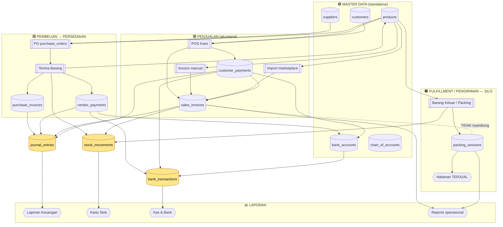
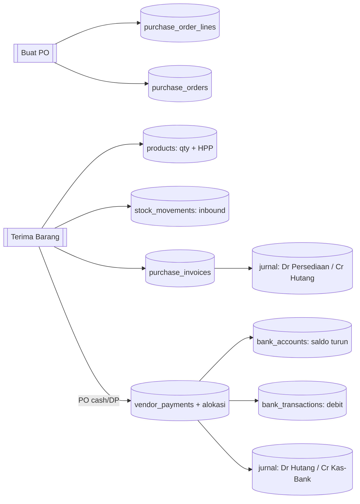
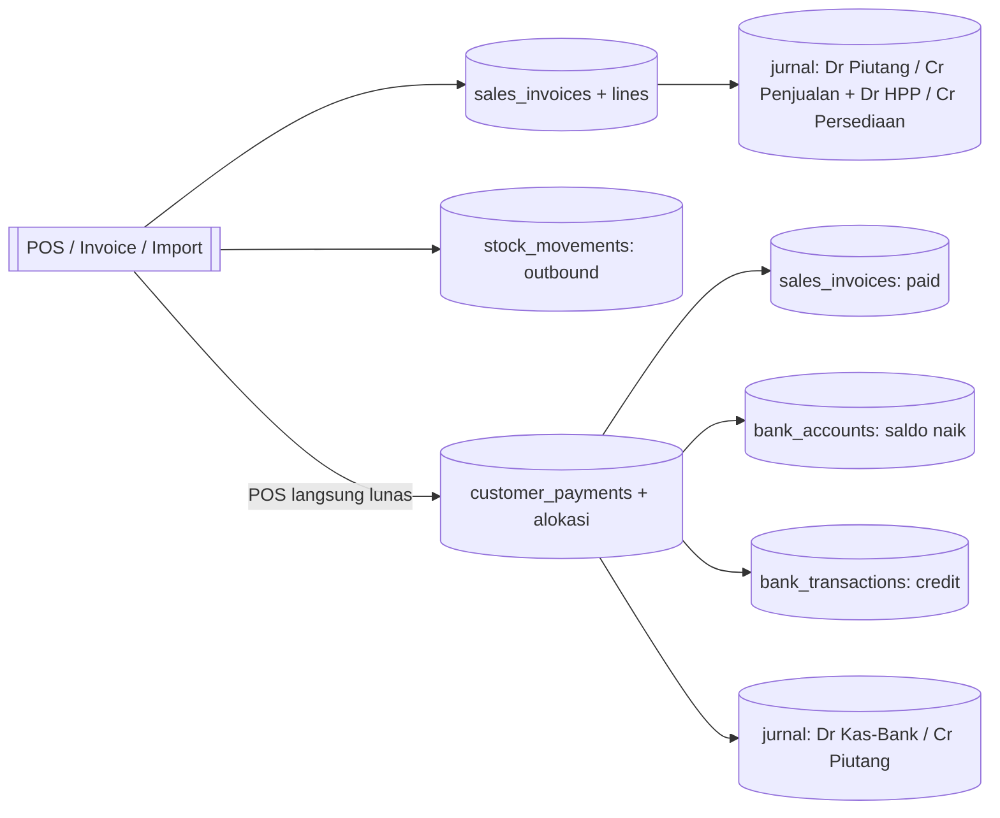
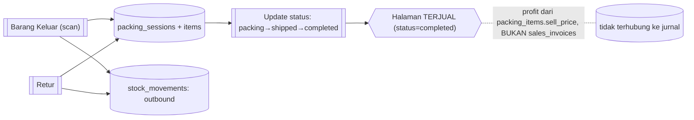
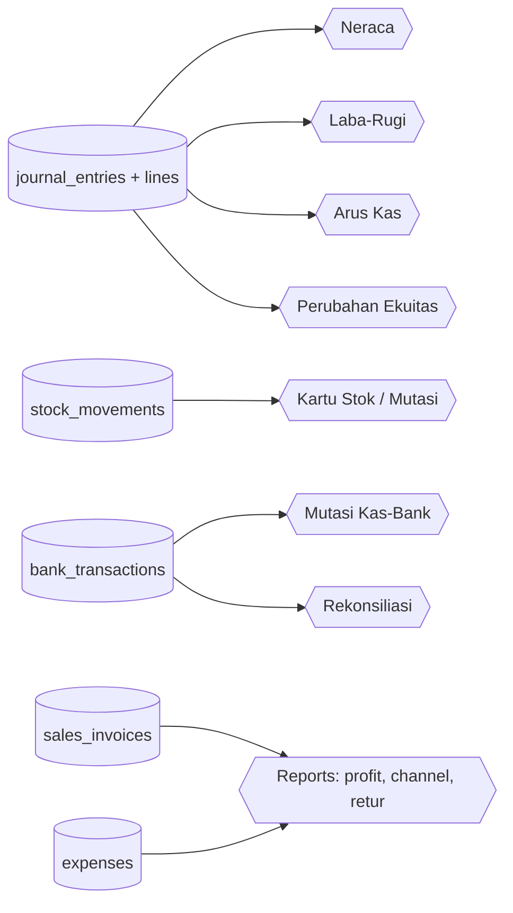

# Peta Alur Data — SneakerVault / Dewins.id

> Tujuan: lihat **mana data yang berdiri sendiri (standalone)** dan **mana yang saling terintegrasi**, supaya testing tidak bingung.
> Dibuat dari pembacaan kode asli (`apps/web/src/lib/actions/*`), bukan asumsi. Diagram pakai **Mermaid** (otomatis ter-render di GitHub / VS Code).

---

## 1. Cara baca (legend)

- `[(tabel)]` = tabel database.
- `[[Aksi]]` = aksi/modul yang kamu klik di UI.
- `{{Laporan}}` = halaman laporan/lihat (read-only).
- **Kotak kuning** = **titik kumpul (convergence)** — banyak aksi bermuara ke sini.
- **Garis putus-putus** = hubungan lemah / silo (tidak saling sinkron).

**3 titik kumpul utama** (hampir semua transaksi lewat sini):
1. `stock_movements` → kartu stok / mutasi persediaan
2. `journal_entries` + `journal_lines` → **Laporan Keuangan** (Neraca, Laba-Rugi, Arus Kas, Ekuitas)
3. `bank_accounts` + `bank_transactions` → **Kas & Bank** + Rekonsiliasi

---

## 2. Ringkasan: STANDALONE vs TERINTEGRASI

| Kategori | Modul | Efek samping |
|---|---|---|
| 🟦 **Master / Config (standalone)** | Produk, Supplier, Customer, Akun Bank, Chart of Accounts, Kategori Beban, Setting Struk, Users, **Tutup Buku (periode)** | CRUD biasa. **Tidak** bikin jurnal. (Catatan: `produk.quantity/hpp` & `bank.saldo` DIUBAH oleh modul transaksi.) |
| 🟩 **Transaksi (terintegrasi penuh)** | **POS**, Invoice penjualan, Import marketplace, PO → Terima Barang, Faktur beli, Pembayaran customer/vendor, Pengeluaran, Stock Opname | Menulis ke **stok + jurnal + kas** sekaligus → muncul di Laporan Keuangan. |
| 🟧 **Fulfillment (SILO terpisah)** | **Barang Keluar/Packing**, Status pengiriman, Halaman **Terjual**, Retur (sisi packing) | Mengurangi **stok**, TAPI **tidak** bikin jurnal/penjualan. Jalur sendiri. ⚠️ lihat §7. |
| ⬜ **Utilitas / Audit** | Generate Barcode, Activity Log, Delete Request, Notifikasi | Tidak nyentuh akuntansi. |

---

## 3. Peta besar (overview)

---

## 4. Detail per-alur

### 4a. Pembelian → Persediaan

### 4b. Penjualan (akuntansi) — POS / Invoice / Marketplace

### 4c. Fulfillment / Pengiriman — SILO ⚠️

### 4d. Muara → Laporan

---

## 5. Tabel lengkap: Modul → tulis ke tabel → jurnal? → stok? → muara

| Modul (aksi) | Tabel ditulis | Post jurnal | Tulis stok | Muncul di |
|---|---|---|---|---|
| **POS** (`pos_checkout` RPC) | sales_invoices(+lines), customer_payments(+alloc), bank_accounts, bank_transactions | ✅ ×2 (sales + payment) | ✅ outbound | Penjualan, Kas-Bank, Laporan Keuangan, Reports |
| **Invoice penjualan** | sales_invoices(+lines) | ✅ sales | ✅ outbound | Penjualan, Lap. Keuangan, Reports |
| **Import marketplace** | sales_invoices(+lines) | ✅ sales | ✅ outbound | Penjualan, Lap. Keuangan, Reports |
| **Penerimaan kas (customer)** | customer_payments(+alloc), sales_invoices, bank_accounts, bank_transactions | ✅ payment | — | Kas-Bank, Lap. Keuangan |
| **PO** | purchase_orders(+lines) | — | — | Pembelian |
| **Terima Barang** | products(qty/HPP), purchase_order_lines, purchase_orders, purchase_invoices, vendor_payments(+alloc), bank_accounts, bank_transactions | ✅ ×2 (faktur + bayar) | ✅ inbound | Pembelian, Persediaan, Kas-Bank, Lap. Keuangan |
| **Faktur beli** | purchase_invoices | ✅ purchase | — | Pembelian, Lap. Keuangan |
| **Pembayaran vendor** | vendor_payments(+alloc), purchase_invoices, bank_accounts, bank_transactions | ✅ payment | — | Pembelian, Kas-Bank, Lap. Keuangan |
| **Pengeluaran/beban** | expenses, bank_accounts, bank_transactions | ✅ expense | — | Kas-Bank, Lap. Keuangan, Reports |
| **Stock Opname** | stock_opname_sessions(+lines), products(qty) | ✅ adjustment | ✅ adjustment | Persediaan, Lap. Keuangan |
| **Barang Masuk (inbound scan)** | products, purchase_batches | — | ✅ inbound | Persediaan |
| **Barang Keluar / Packing** 🟧 | packing_sessions, packing_items | — | ✅ outbound | **Terjual**, Orders |
| **Status pengiriman** 🟧 | packing_sessions | — | — | **Terjual**, Orders |
| **Retur** | returns, packing_sessions | — | ✅ in/out | Returns, Terjual |
| **Jurnal manual** | journal_entries(+lines) | ✅ | — | Buku Besar, Lap. Keuangan |
| **Transaksi bank manual** | bank_transactions, bank_accounts | — | — | Kas-Bank |
| **Rekonsiliasi** | bank_transactions (tandai cocok) | — | — | Kas-Bank |
| **Data Sync (cutover)** | suppliers, customers, products, sales_invoices, purchase_invoices, bank_accounts | ✅ (saldo awal) | ✅ | semua |
| Produk / Supplier / Customer / Akun Bank / Kategori | (tabel masing-masing) | — | — | master |

---

## 6. Klasifikasi untuk testing

- **Berdiri sendiri (aman dites lepas):** Produk, Supplier, Customer, Akun Bank, Kategori Beban, Setting Struk, Users, Generate Barcode.
- **Terintegrasi (sekali aksi → banyak tabel + laporan):** POS, PO/Terima, Invoice, Pembayaran, Pengeluaran, Opname, Import. **Cek efeknya di Persediaan + Kas-Bank + Laporan Keuangan.**
- **Silo fulfillment:** Barang Keluar/Packing → Terjual. **Cek di halaman Terjual & Orders**, BUKAN di Laporan Keuangan.

---

## 7. ⚠️ Titik perhatian (silo & risiko)

1. **Dua jalur "terjual" tidak sinkron:**
   - **Akuntansi:** POS/Invoice/Marketplace → `sales_invoices` → Laporan Keuangan.
   - **Fulfillment:** Packing → `packing_sessions` → Halaman **Terjual**.
   - Akibat: **penjualan POS TIDAK muncul di halaman Terjual.** Halaman Terjual sebenarnya = "riwayat barang dikirim", bukan "semua penjualan".
   - **Risiko double-count** kalau 1 order online tercatat di kedua jalur (mis. import marketplace + packing manual). → butuh keputusan desain.
2. **`products` & `bank_accounts` itu master, tapi saldonya hidup** — diubah oleh modul transaksi. Jangan kaget angkanya berubah setelah jual/beli.
3. **Tutup Buku (fiscal period)** mengunci SEMUA posting transaksi pada bulan yang ditutup.

---

## 8. Urutan test yang disarankan (dependency order)

1. **Master dulu:** buat Akun Bank → Supplier → Customer → Produk (1 dulu).
2. **Beli & masuk:** buat PO → Terima Barang → cek stok produk naik + HPP + (kalau cash/DP) saldo bank turun + jurnal.
3. **Jual:** POS 1 transaksi → cek stok turun, saldo bank naik, invoice `paid`, jurnal balanced.
4. **Lihat hasilnya:** Reports + Laporan Keuangan (Neraca/LR) + Kartu Stok + Mutasi Kas-Bank.
5. **Fulfillment (terpisah):** Barang Keluar/Packing → Terjual.
6. **Lainnya:** Pengeluaran, Opname, Retur, Pembayaran, Rekonsiliasi.
7. **Tutup buku** terakhir untuk lihat penguncian.
